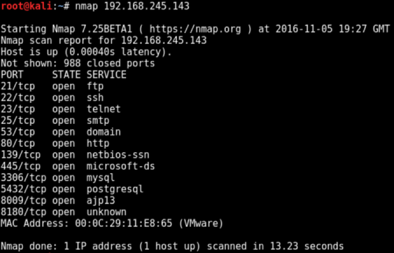

# Vulnhub Setup Guide

## Intro

This is just a quick guide on how to get setup to play the boxes from Vulnhub. I personally had a lot issues setting up boxes and connecting to them successfully for a while, but I will detail what I use at the moment which works on 95% of boxes (with the exception being static IP boxes...for now).

My setup is VMware Fusion in Mac OSX, so some of the names may be slightly different in Windows and Linux. I use Kali in VMware as my attacking machine.

## Security

Use the checksums before running the VM to ensure that they haven't been altered - see [guide](https://www.vulnhub.com/faq/#checksum)

Ensure that you have the necessary security in place - see [guide](https://www.vulnhub.com/faq/#security)

## File Types

`.vmx`, `.ova` and `.iso` are the most common file types that you will encounter.

## DHCP vs Static IP

The majority of boxes will use DHCP to automatically provide an IP address for the box when it is first booted. Usually this will be confirmed in the box description which will mention something of the lines of "DHCP service enabled", "VM gets its IP through DHCP" or "VM is set to grab a DHCP lease on boot".

I haven't yet figured out how to deal with Static IP boxes.

## VMware Player/Fusion

VMware is the Vulnhub **RECOMMENDED** choice for running the virtual machines. Vulnhub staff have told me that they always test that new boxes are working using VMware, which is the reason for that recommendation.

VMware Player is a free version, and Fusion is a paid version with additional features. I personally use Fusion since my work gave me a license.

For this example, I will use [Metasploitable 1](https://www.vulnhub.com/entry/metasploitable-1,28/) which will provide us with a `.vmx` file once the download has been unzipped as shown below:

Double click on the `.vmx` file `Metasploitable.vmx` and VMware will open with a prompt:

Usually I select "I Copied It" so that it generates a new UUID for the VM, so that it doesn't clash with the original VM. There has been at least one occasion when this didn't work and I had to use "I Moved It" instead (may have been specified in the box description).

Then select the network option button and select "Host-only". Alternatively, you can also go into the box `Settings -> Network Adapter` and select `Private to my Mac` (must be named something similar on Windows).

Usually you don't need to reboot when making this change, but you may have to if this step doesn't work properly for whatever reason.

Next, wait until the box has fully booted, and you should be at a login prompt:

Only on rare occasions will the creator provide credentials to login at this stage, which is usually for debugging purposes only.

Have your attacking VM machine ready and also set to "Host-only" in the network settings. I am assuming that you're using some version of Kali, and I have both 32bit and 64bit versions ready to use.

From your attacking machine, find out your IP address with `ifconfig`:

Now we search for the booted VM using Nmap to perform a ping scan with `nmap 192.168.245.1-254 -sP`, or if you are lazy and don't mind waiting a bit longer then remove the `-sP` option!:

We know that our attacking box IP ends with `.157` so we are usually looking for something "close" to that number (usually ignoring `.1` and `.254` which are used for other things). `.143` is "close" and as you load more Vulnhub boxes, you'll see that with a DHCP lease the next box would simply be an increment on the last, i.e. it's likely `.144` will be the address used for the next box.

Next we can do a basic Nmap scan on the IP found:

It shows a number of ports open which is what we expect for this specific box. Port 80 is open, so now visit it in the browser and see that we're ready to rock and roll!

Note that by using "Host-only" which creates a speparate network for the virtual machines, you can't connect to the internet. However, you can easily switch the network settings on your attacking machine back to a different option to temporarily gain internet access if required.

## VirtualBox

Coming soon...

## Common Errors

Coming soon for:

USB
MAC address
Move/Copied
